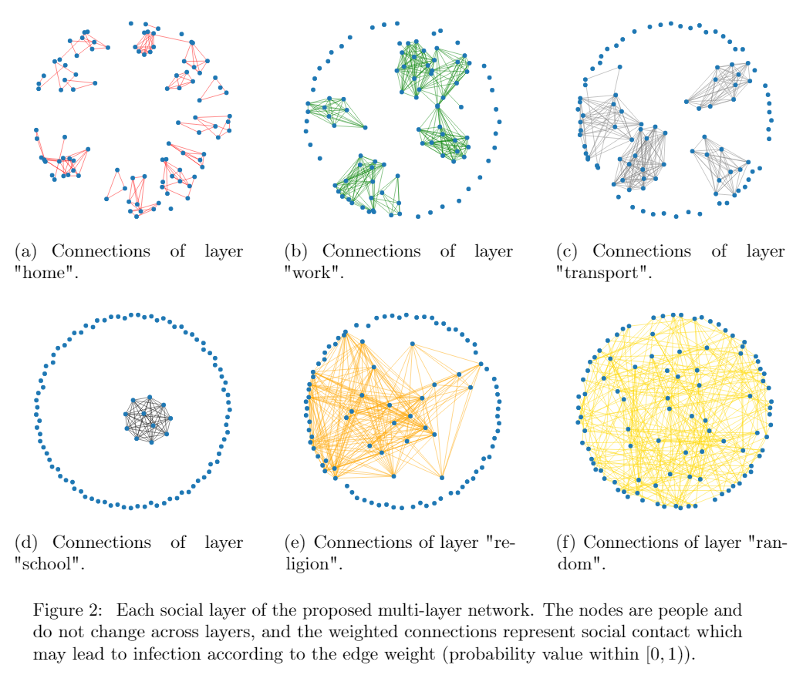

# COmplexVID-19

## Notes on Fork

This fork translates the Portuguese comments (and in limited cases, some 
strings) to English. The translation was performed by Clayton T. Morrison 
(github: cl4yton, email: claytonm@arizona.edu)
(with heavy use of Google Translate) in April 2022. Everything else 
maintains the original implementation up to the time of the fork (April 15, 
2022). All acknowledgements should still reference the original paper and 
acknowledge the author *Leonard F. S. Scabini*.

### Comment notation

In general, all comments provide English translation of the original 
Portuguese at the locations of the original comment. Two additional types of 
comments were sparingly introduced, and indicated by starting with the 
following tags: 
* `<ctm>`: additional comments, generally noting the English translation of 
  Portuguese words used as the basis of code identifiers.
* `<ctm-code>`: commented out version of the original code that has now been 
  replaced (generally due to translating a Portuguese word/phrase in a 
  string to English).

## Introduction

Source code for the paper:

"Social interaction layers in complex networks for the dynamical epidemic modeling of COVID-19 in Brazil."
Physica A: Statistical Mechanics and its Applications 564 (2021): 125498.
Leonardo F. S. Scabini, Lucas C. Ribas, Mariane B. Neiva, Altamir G. B. Junior, Alex J. F. Farfán, Odemir M. Bruno

contact: scabini@ifsc.usp.br

<p align="center">
    
</p>

## Usage

The main script to perform an experiment is "run.py"
   * Runs the dynamic network in parallel, where each thread is a different iteration (with a different random seed). The final results are the average between iterations. On this code we set 10 iterations; on the paper, 100 iterations where performed for better statistical results.
   * The script has several parameters that should be manually adjusted according to the society one wants to model. The comments (in portuguese) should guide you.


Libraries used:
networkx 2.4, matplotlib, pickle


## Cite

If you use this method, please cite our paper:

Scabini, L. F., Ribas, L. C., Neiva, M. B., Junior, A. G., Farfán, A. J., & Bruno, O. M. (2021). Social interaction layers in complex networks for the dynamical epidemic modeling of COVID-19 in Brazil. Physica A: Statistical Mechanics and its Applications, 564, 125498.

```
@article{scabini2021social,
  title={Social interaction layers in complex networks for the dynamical epidemic modeling of COVID-19 in Brazil},
  author={Scabini, Leonardo FS and Ribas, Lucas C and Neiva, Mariane B and Junior, Altamir GB and Farf{\'a}n, Alex JF and Bruno, Odemir M},
  journal={Physica A: Statistical Mechanics and its Applications},
  volume={564},
  pages={125498},
  year={2021},
  publisher={Elsevier}
}
```
